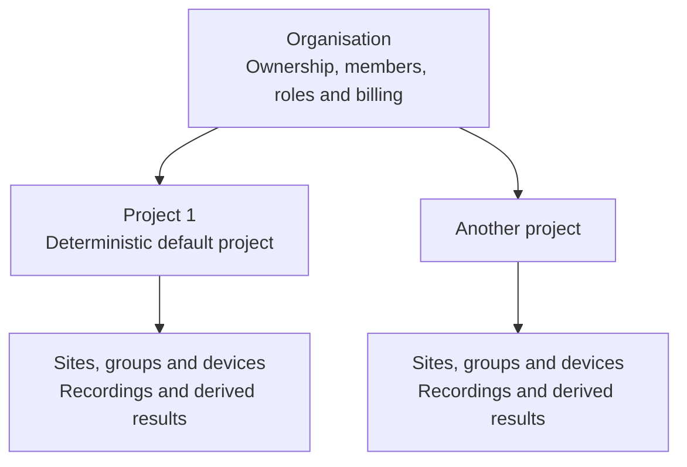
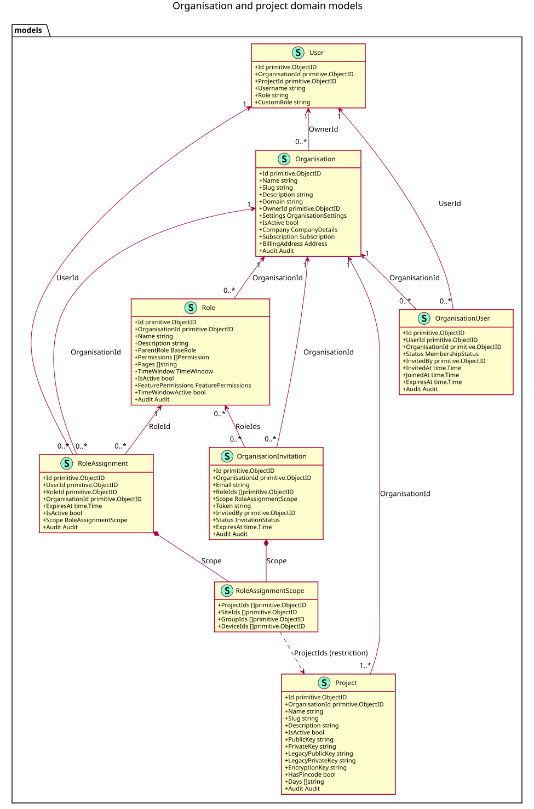
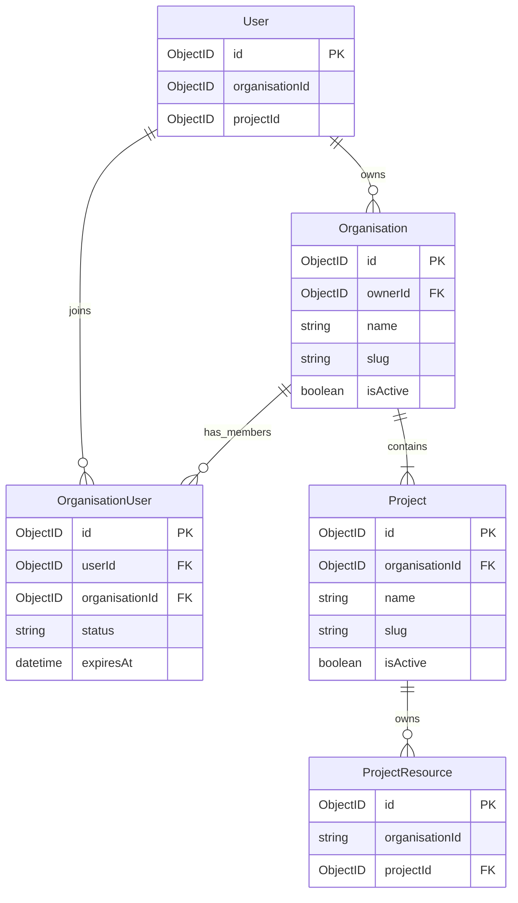
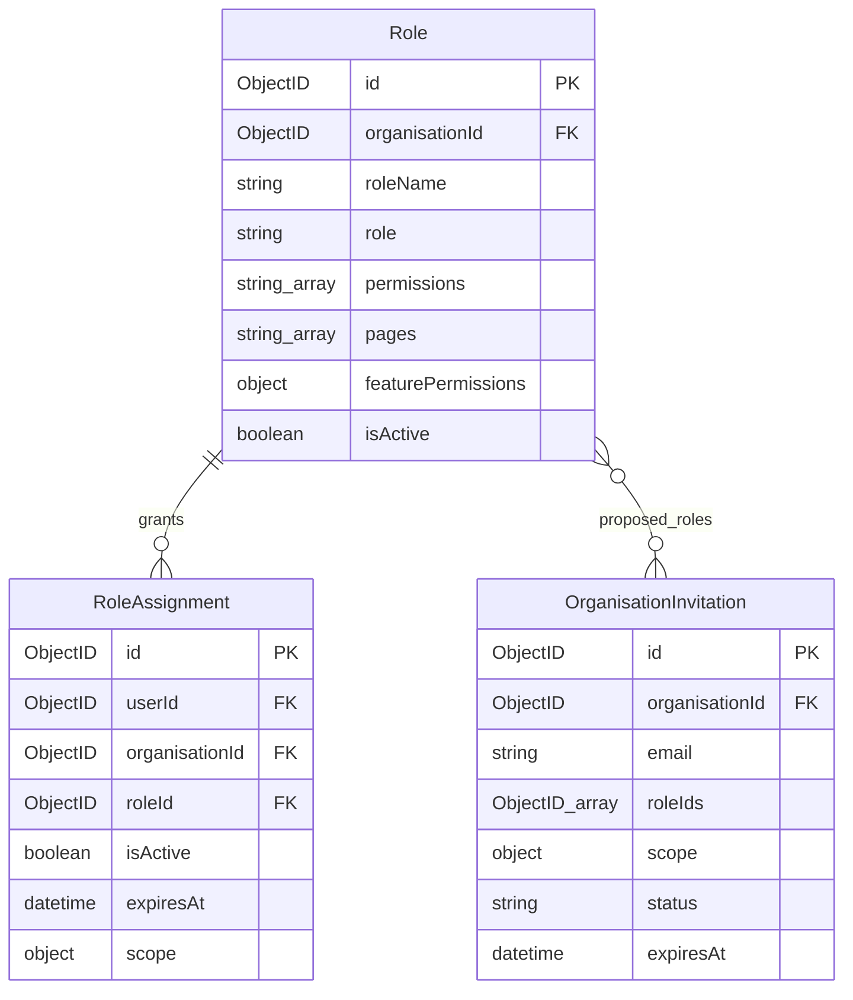
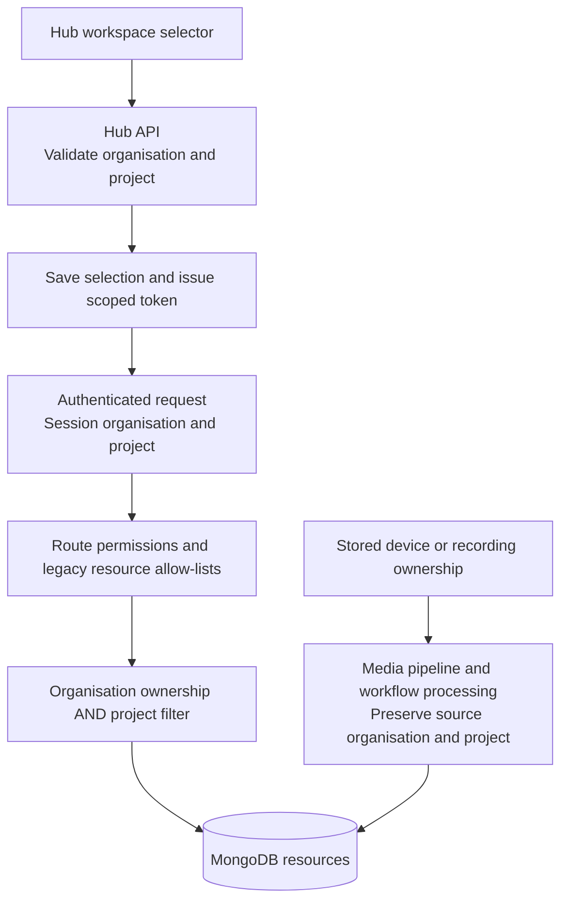

An **organisation** is the tenant boundary for shared resources in Kerberos Hub. A **project** separates operational resources inside that organisation. A **workspace** is the organisation/project pair selected for a session; it is not a separate stored entity.

A user can own or belong to more than one organisation without creating another login. Membership, resource ownership, authorization, and the currently selected workspace are separate concerns: selecting a workspace does not grant access to it.

> [!NOTE] Feature flags
> Organisation and project controls are opt-in and hierarchical. The organisation umbrella can override both families; otherwise their group and child flags apply independently. See [Feature flags](#organisations-and-projects) before enabling switching, creation, or settings.

## Core concepts

| Concept | Responsibility |
| --- | --- |
| Organisation | Owns shared Hub resources and organisation-level company, billing, and regional settings. |
| Project | Provides an operational and access boundary inside one organisation. Every project belongs to exactly one organisation. |
| Membership | Connects a user to an organisation, with its own status and optional expiry. Membership alone grants no capabilities. |
| Current organisation | Selects the organisation context used by organisation-aware Hub activity. |
| Current project | Selects the project context used by project-aware Hub activity. It is navigation state, not proof that the user may access the project. |
| Role | Defines what actions a member may perform. Roles belong to an organisation and can be reused in its projects. |
| Role assignment | Connects a user and an organisation-owned role, with an optional expiry and resource scope. See [Authorization and rollout](#authorization-and-rollout) for the live authorization path. |

## Organisation and project structure

An organisation is the parent identity, membership, billing, and policy boundary. A project is a child boundary used to isolate operational resources and access within that organisation.



The same user identity can be a member of several organisations. The shared assignment model can describe access to one project, several projects, or the complete organisation; the current API does not yet resolve those assignments for authorization. Hub does not create a separate user account for each project.

The records have separate responsibilities:

| Record | Relationship | Responsibility |
| --- | --- | --- |
| User | One person or service identity | Sign-in, profile, preferences, and current organisation/project selections. |
| Organisation membership | User + organisation | Membership lifecycle such as pending, active, suspended, revoked, or expired. It grants no capabilities by itself. |
| Project | Project + organisation | Names an access and resource boundary inside the organisation. |
| Role | Role + organisation | Defines capabilities such as viewing live video or managing devices. |
| Role assignment | User + organisation + role + scope | Grants a role to a member and says where that grant applies. |
| Operational resource | Resource + organisation + project | Places a site, group, device, recording, or derived result inside one project boundary. |

Organisation memberships and role assignments are sibling records joined by the same user and organisation identifiers. Assignments are not embedded in the membership, so membership lifecycle and authorization lifecycle can be managed independently.

## Model diagram

These diagrams show the shared domain models and their logical relationships, not database-enforced foreign keys.

### Go-model UML overview

The overview below combines the eight organisation/project-related types from the current shared Go models: `User`, `Organisation`, `Project`, `OrganisationUser`, `Role`, `RoleAssignment`, `OrganisationInvitation`, and `RoleAssignmentScope`. Fields were extracted with GoPlantUML; ObjectID relationships and cardinalities were added explicitly because Go types alone do not identify the referenced entities.



[Open the full-size SVG](organisation-project.svg) · [Download the PlantUML source](organisation-project.puml)

The diagram is a snapshot of the Go definitions, not the proposed GCP-inspired alternative. Only identity and selection fields are shown for `User`; supporting company, settings, audit, and operational resource types are not expanded. Go field names and types are shown, not JSON/BSON field spellings or an API response schema. Credential fields identify model fields only; no credential values are included.

Every organisation has at least one **logical** project: its deterministic default. The `1..*` relationship includes that project even before its metadata document is materialized. Assignment and invitation scopes are separate embedded values of the same type, not references to a shared scope document.

> [!NOTE] Model versus runtime
> This diagram describes the shared model, not complete runtime authorization enforcement. Canonical scoped assignments and the invitation model are not yet an end-to-end access-management workflow. See [Authorization and rollout](#authorization-and-rollout).

The following smaller diagrams split ownership and access for readability. `ProjectResource` represents project-owned models such as `Site`, `Group`, `Device`, and `Media`; there is no collection with that name. Embedded company, settings, subscription, and audit fields are omitted from these smaller views.

### Ownership and membership



### Roles, assignments, and invitations

Each of these records belongs to an organisation. An assignment references a user and one role; an invitation references the roles intended for its recipient. Membership and assignments are joined through `(userId, organisationId)`, not a `membershipId` field.



### Identity and ownership fields

- `Organisation.ownerId` points to the responsible user. It is not the organisation's identifier, except where a legacy owner and its deterministic organisation deliberately share the same ID.
- `OrganisationUser` is the membership join. Its states are `pending`, `active`, `suspended`, and `revoked`. Expiry is an additional time constraint, not a fifth stored membership state.
- `RoleAssignment` references a role and user within an organisation. Its `isActive` and `expiresAt` are independent of membership status.
- `OrganisationInvitation` stores the invited email, role IDs, and the scope intended for those roles on acceptance. Its states are `pending`, `accepted`, `expired`, and `revoked`. Having this model does not mean that the invitation workflow is available in the current UI.
- `User.organisationId` and `User.projectId` store selection state, not a membership or grant. There is no separate project-membership model: project restrictions are represented in assignment scope.
- The Go field `Role.ParentRole` is serialized as `role`. It identifies a built-in tier such as `guest`, `editor`, `admin`, `owner`, or `application`, not another role document.

Use the declared field types when integrating with MongoDB. Core organisation, project, membership, and assignment identifiers use BSON ObjectIDs. Operational models such as `Site`, `Group`, `Device`, and `Media` store `organisationId` as a hex string and `projectId` as an optional BSON ObjectID. JSON uses hex strings for ObjectIDs. Do not convert every ownership field to one BSON type or assume that legacy fields all share the same spelling.

### Assignment scope

`RoleAssignment.scope` is embedded and has four ObjectID-array fields:

| Field | Restriction |
| --- | --- |
| `projectIds` | Projects covered by the assignment. |
| `siteIds` | Sites covered by the assignment. |
| `groupIds` | Resource groups covered by the assignment. |
| `deviceIds` | Devices covered by the assignment. |

In the **current shared model**, an empty array means **no restriction on that dimension**. A completely empty scope is organisation-wide for the assigned role. An assignment can name more than one project; use separate assignments when the role, scope, or expiry differs.

For example, a scope containing `projectIds: [projectA]` and `deviceIds: [camera1, camera2]` describes one project and two devices within it; empty site/group arrays do not independently restrict those dimensions.


An empty scope is not a deny-all grant. Do not create an active assignment with an empty scope as a placeholder for access that will be configured later. Scope describes the shared RBAC model; the live authorization limitations below still apply.


## Runtime architecture

The workspace context passes through the UI, authenticated session, Hub API, and storage layer. Background processing uses the source resource's context instead of an interactive user's mutable selection.



### Interactive requests

1. The selector submits an organisation/project pair to `PATCH /workspace/current`. The API verifies organisation access and that the selected project belongs to that organisation and is active.
2. The pair is saved together on the user record and a refreshed JWT pins it to the switching session. Updating one session's selection does not repoint another existing session's token.
3. Request handling uses the authenticated context, not arbitrary client-supplied ownership fields. The access-token path also revalidates its stored binding.
4. The interactive project resolver uses the selected project, or the deterministic default if none is selected. Resource readers apply both ownership axes; interactive creation uses the resolved workspace.

`PATCH /organisations/current` selects an organisation and resets the project to its default. `PATCH /projects/current` updates the stored project selection but is not the token-refreshing workspace-switch operation used by the UI.

### Background processing

Pipeline intake resolves the stored device's organisation and project and propagates them with the event. Workflow runs persist that scope and carry it to workers in their user-context projection. Derived recordings, detections, markers, and other results must retain the source ownership pair.

The distinction is important: an interactive user can switch to Project B while a recording from Project A is still being processed. That switch must not cause the result to be stored in Project B.

## Authorization and rollout

The shared models describe the organisation-scoped RBAC design, but **the current Hub API does not use canonical `RoleAssignment` records as its live permission source**.

| Layer | Current behavior |
| --- | --- |
| Organisation selection | Resolves accessible organisations using ownership, current context, and active, unexpired memberships. |
| Project selection | Validates the project against the selected organisation and its active state; supports the logical default even before its document exists. It does not evaluate `RoleAssignment.scope.projectIds`. |
| Role and resource permissions | Existing built-in/custom account roles, page/feature permissions, and endpoint-specific site/group/camera allow-lists remain in use. |
| Organisation/project administration | Organisation updates, project creation/updates, and project credential operations use owner/admin role gates in addition to the applicable organisation/project checks. |
| Canonical role assignments | Shared model is present, but the assignment-based request resolver and user-facing assignment-management API are not wired into these flows. |

Project **data isolation** is implemented through ownership filters and session scope. This is not the same as **per-member project entitlement** through scoped assignments. Do not rely on inserting a canonical assignment to grant or restrict a user's current API access.

The assignment design separates **what** a member may do (the role) from **where** (the scope). It can represent a security-operator role in Project A and a viewer role in Project B as separate assignments for the same user and organisation. A future live assignment resolver must retain that role/scope association and require valid membership; flattening permissions and project IDs separately would incorrectly combine grants.

Sites and groups organize operational resources, not people. They must remain within the appropriate organisation/project boundary. There is no access-team principal in the current shared assignment model, and no separate project membership collection.

For the currently available account and custom-role controls, see [Roles](). The workspace users pane continues to lead to that existing account-management flow.

## Ownership and isolation

Organisation ownership and project scope are separate filters. A project filter narrows an already tenant-scoped query; it never replaces the organisation boundary. Personal profile, sign-in credentials, preferences, and selection state remain attached to the user.

For project-owned resources, reads combine the resolved organisation, project, and applicable permissions. Writes preserve the same ownership pair. A recording and its derived workflow results must follow the source resource's ownership, not whichever workspace a user has selected since the recording was created.

### The default project

Every organisation has a deterministic default project:

```text
defaultProjectId(organisationId) = organisationId
initial name = "Project 1"
reserved slug = "project-1"
```

The default project is a real project identity, not a wildcard meaning "all projects". Its document can be materialized lazily with that ID. Its display name can change; its reserved slug and identity are not an invitation to create a second default. Other projects have their own IDs.

### Legacy compatibility without a required migration

Historical project-scoped resources may not contain canonical ownership fields. A valid stable legacy owner/tenant ID supplies both missing axes:

```text
legacy ownerId = X
resolved organisationId = X
resolved projectId = X
```

This is a runtime interpretation, not a requirement to rewrite the document first:

1. Preserve an existing non-empty canonical organisation.
2. Preserve an existing non-empty project assignment.
3. Resolve missing organisation ownership from the collection's stable legacy owner/tenant field.
4. Resolve a missing project to that organisation's deterministic default.

The default project's compatibility reads include unstamped project records. A different project's reads require an explicit matching project ID, so historical resources do not appear in every project.

Legacy field names and BSON types vary by collection. Creator, actor, recipient, and payer fields are provenance, not alternate ownership once a higher-precedence canonical or tenant field exists. Changing a user's current workspace must not move their historical resources.

Backfills are optional normalization for eventual removal of compatibility paths. They are **not a prerequisite for visibility, isolation, authorization, or correct processing**. If an unmigrated resource disappears from its valid owner's default project, investigate the runtime ownership resolver rather than treating a backfill as the fix.

## Creating an organisation

When organisation creation is enabled, open the workspace menu below the Hub logo and select **Create organisation**. The API requires authentication; frontend flags control whether the action is shown, not whether an API request is authorized. The creator becomes the owner and receives an active membership.

The form is divided into three tabs:

- **General** contains the organisation name, domain, and description. The name is required and must contain between 2 and 120 characters.
- **Company** contains the legal name, trading name, industry, and website.
- **Contact & location** contains a company email address and phone number, together with the billing street, city, region, postal code, and country.

All fields except the organisation name are optional. After creation, the frontend selects the new organisation, stores the refreshed session token, and reloads the application.

The optional organisation domain is metadata stored on the organisation. It does not configure the subdomain-based login feature described in [Domains]().

## Switching organisations and projects

The sidebar shows the current workspace. When organisation and project switching are enabled:

1. Open the workspace menu.
2. Select an organisation to browse its available projects. This is a draft selection; browsing alone does not change the active session.
3. Select a project to switch the organisation/project pair.
4. Hub validates the selection, saves it, returns a refreshed token, and reloads the application to discard the previous workspace's cached view.

The frontend uses the workspace-selection endpoint even for a project switch inside the same organisation. This refreshes the session's scope rather than only changing a database preference. When the project switcher is disabled, selecting an organisation uses the organisation-selection endpoint and its default project.

Switching does not create memberships, grant permissions, or transfer resources. Only organisations and projects allowed by the backend should be selectable.

### Creating and managing projects

When project creation is enabled, create a project in the currently active organisation through the workspace menu. Provide its name, slug, and optional description. After creation, Hub selects the new project. Browsing a different organisation in the menu is not sufficient to create a project there; switch to it first.

Project settings include the current project's general details and integration credentials. The project model holds its public/private keys, legacy key pair, encryption key, and PIN-code state. These belong to the project, not to an individual member's profile. Ordinary project JSON responses omit the secret fields; dedicated credential operations control their retrieval and generation.

Deleting a project through the API deactivates it rather than deleting its resources. The default project cannot be deleted.

## Members and access

Ownership, membership, and roles answer different access questions:

- **Ownership** identifies the user responsible for the organisation. Creating an organisation makes the creator its owner.
- **Membership** allows a non-owner to select an organisation. Only active memberships that have not expired are included in the organisation switcher, and membership alone grants no capabilities.
- **Roles and permissions** currently come from the existing account role and resource allow-lists. Organisation-scoped roles and assignments are the target authorization model, not the live authority in this phase.

The organisation model supports pending, active, suspended, and revoked memberships, as well as an optional expiry date. Invitation and membership-management screens are not part of the initial organisation-switcher rollout. Existing account and subaccount administration remains the way to manage user access during this phase.

For permission details, see [Roles]().

## Organisation settings

Organisation records can hold shared company details, billing information, regional defaults, contacts, and access-policy settings. These values belong to the organisation and therefore remain the same regardless of which member is viewing it.

The **Workspace** settings page at `/workspace` exposes organisation general details, company information, billing address, contacts, regional defaults, users, and subscription information, alongside the current project's settings. Its navigation entry is feature-gated and shown to eligible owner/admin users; the API independently checks access.

The users pane links to the existing account-management screen. Do not confuse this with a complete organisation invitation or scoped-role-assignment editor. Likewise, the presence of policy fields such as `forceMFA`, `allowedDomains`, or `defaultRoleId` in the shared model does not by itself establish a complete UI or enforcement flow for those policies.

User profile settings remain personal and follow the user when they switch organisations.

## Domains and organisations

A login domain and an organisation solve different multi-tenancy problems:

- A **login domain** provides a sign-in and username namespace through the Hub hostname. It allows the same visible username to exist in different domains.
- An **organisation** owns resources and provides the context in which members work after signing in.

A domain does not automatically combine its users into one organisation. Existing domain-prefixed users keep their login namespace when organisations are introduced. Likewise, setting the domain field on an organisation does not create DNS records or enable domain-based login.

For login-domain configuration, see [Domains]().

## Configuration and rollout

Organisation and project controls are available in the Helm chart, but remain opt-in. The umbrella values are empty by default and the individual switcher, creation, and settings flags default to `"false"`. For example:

```yaml
kerberoshub:
  frontend:
    features:
      organisations:
        enabled: ""
        switcherEnabled: "true"
        creationEnabled: "true"
        settingsEnabled: "true"
      projects:
        enabled: ""
        switcherEnabled: "true"
        creationEnabled: "true"
        settingsEnabled: "true"
```

An explicit organisation umbrella overrides both feature families; when it is empty, the project group and individual flags apply. Creation needs the corresponding switching UI. See [Feature flags](#organisations-and-projects) for the complete hierarchy and environment-variable mappings.

These flags control the interface. They neither grant backend permissions nor select the database ownership contract.

## Migrating existing accounts

Keep identity materialization separate from resource normalization. Bootstrap or lazy creation can materialize the deterministic organisation/default-project records and preserve legacy owner/sub-user relationships. It must not combine unrelated owner accounts, overwrite valid selections, or invent new ownership for historical resources.

The shared tenancy helpers distinguish three storage contracts:

| Mode | Meaning |
| --- | --- |
| `compatibility` | Canonical-first organisation ownership with legacy fallback; missing project scope belongs only to the default project. This is the default when the mode is unset. |
| `canonical` | Exact canonical organisation and project fields. Use only after validating complete canonical coverage for the relevant data. |
| `legacy` | Legacy owner-field reads without the project boundary; not a multi-project isolation contract. |

These storage modes are separate from the RBAC rollout. Enabling a workspace control does not migrate data or activate canonical role assignments. Backfills can prepare for canonical-only storage later, but ordinary compatibility-mode operation must already work without them.

Existing login domains are preserved. They remain sign-in namespaces and are not copied into the organisation domain field.

## Troubleshooting

### The current organisation is visible but cannot be selected

Check the effective organisation/project flag hierarchy. A disabled umbrella overrides enabled child controls. See [Feature flags](#organisations-and-projects).

### The create action is missing

Enable creation and switching for the corresponding feature family. For projects, also confirm that the organisation being browsed is the active organisation and that the caller is permitted to create projects.

### Hub shows "No organisation"

Check identity resolution and organisation/membership availability. An owner should resolve to an organisation they own; a member needs an active, unexpired relationship. Investigate errors in lazy identity materialization rather than assuming that every installation requires a manual resource migration.

### The organisation list is unavailable

The list request failed rather than returning an empty list. Check that the versioned Hub API organisation routes are deployed and reachable, and inspect the Hub API logs for the request error.

### Switching fails or returns to the previous organisation

Confirm organisation access, membership status/expiry where applicable, project activity, and project authorization. A workspace switch must return a refreshed token and the frontend must use it. Updating only the user's stored project preference is not equivalent to switching a session.

### Resources are missing after switching

First confirm both workspace IDs and the caller's permissions. Historical unstamped resources belong in the stable owner's default project, not a newly created project. Check canonical ownership precedence, legacy field spelling/BSON type, and the default-project compatibility filter. Membership and switching do not move resources. A missing historical backfill is not an acceptable prerequisite for reading a valid legacy resource.