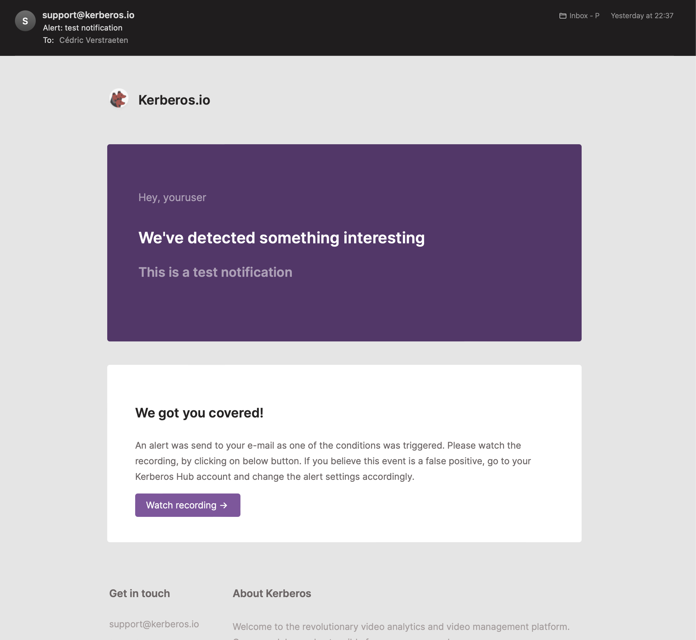

Kerberos Hub can be styled towards your company marketing branding and/or preferred style guides. By injecting a custom CSS file, and overriding our icon library, you can make Kerberos Hub feel like it's your own product; and we do not have any problem with that.

We believe that a consistent and streamlined company branding is important when using 3rd party applications in your companies ecosystem.

Next to styling Kerberos Hub yourself, we can also rebrand the application for your needs as part of the Kerberos Enterprise Suite license. In the end nothing stops you to perform the layout changes yourself, whenever you want.



## Overriding the Kerberos Hub styling

The recommended approach to add your custom styling is to inject a custom stylesheet file `.css` in the Kerberos Hub Front-end container. Let's start by creating a `.css` file, and include all the relevant CSS elements which you would like to modify. This could look like [this](https://github.com/kerberos-io/helm-charts/blob/main/charts/hub/custom-layout/style.css).

    .app .sidebar.closed {
      background: red !important;
    }

To know which element you need to style, we advice [to use the inspect elements tool](https://developer.chrome.com/docs/devtools/open/#:~:text=When%20you%20want%20to%20inspect,the%20element%20and%20select%20Inspect.&text=Or%20press%20Command%20%2B%20Option%20%2B%20C,%2C%20Linux%2C%20Chrome%20OS) of your Chrome/Safari/Firefox browser developer tools.

Once you are happy with your styling, you can proceed with the injection in the front-end container.

Injection is done through the concept of Persistent Volumes (PV). A PV is mapped in a front-end container, and is overriding the local directory of the front-end container with your changes made in the PV. If you are not familiar with a PV, [you might need to learn about it first](<https://kubernetes.io/docs/concepts/storage/persistent-volumes/#:~:text=A%20PersistentVolume%20(PV)%20is%20a,node%20is%20a%20cluster%20resource.>).

Once you created a PV and uploaded your stylesheet, you should [create a Persistent Volume Claim (PVC)](https://github.com/kerberos-io/helm-charts/blob/main/charts/hub/custom-layout/custom-layout-claim.yaml), so you can share it with the Kerberos Hub front-end container.

To share the PVC, you need to make a few changes in the Kerberos Hub Helm chart `values.yaml`. [Uncomment](https://github.com/kerberos-io/helm-charts/blob/main/charts/hub/values.yaml) the `volumeMounts` and `volumes` properties. Change the PVC accordingly and keep the `mountPath` unchanged.

If all set, commit your changes by doing an `helm install` or `helm upgrade`.

## Custom logo

Similar to **overriding the Kerberos Hub styling** you can inject your own company logo as well. This logo will be used on the login page and sidebar once signed in. Make sure to name your company logo as following, `logo-sidebar.svg`.

To inject your logo, upload it into the same PV as you used for the custom styling.

## Custom icons

If you do not like the icons we are using, you can also modify those by injecting your own SVG icon library. An example of the icon library can be found here: [icon.js](https://github.com/kerberos-io/helm-charts/blob/main/charts/hub/custom-layout/icons.js).

All icons are sorted in alphabetic order, and each icon has a generic naming convention and relevant SVG element.

Make sure you are using SVG icons, we do not support other formats at the moment of writing.

    (function(window) {
    window["env"] = window["env"] || {};
    window["env"]["svg"] = window["env"]["svg"] || {};

        /* Accounts */
        window["env"]["svg"]["accounts"] = `<svg class="icon" width="18" height="18" viewBox="0 0 18 18" fill="none" xmlns="http://www.w3.org/2000/svg">
        <path fill-rule="evenodd" clip-rule="evenodd" d="M9 2C7.89543 2 7 2.89543 7 4C7 5.10457 7.89543 6 9 6C10.1046 6 11 5.10457 11 4C11 2.89543 10.1046 2 9 2ZM5 4C5 1.79086 6.79086 0 9 0C11.2091 0 13 1.79086 13 4C13 6.20914 11.2091 8 9 8C6.79086 8 5 6.20914 5 4Z" fill="currentColor"/>
        <path fill-rule="evenodd" clip-rule="evenodd" d="M3.9981 11.3995C5.29471 9.88675 7.08937 9 9 9C10.9106 9 12.7053 9.88675 14.0019 11.3995C15.2944 12.9074 16 14.9238 16 17C16 17.5523 15.5523 18 15 18L3 18C2.44772 18 2 17.5523 2 17C2 14.9238 2.70558 12.9074 3.9981 11.3995ZM9 11C7.72803 11 6.47044 11.5882 5.51662 12.701C4.75666 13.5877 4.24797 14.743 4.07017 16L13.9298 16C13.752 14.743 13.2433 13.5877 12.4834 12.701C11.5296 11.5882 10.272 11 9 11Z" fill="currentColor"/>
    </svg>`

        /* Activity / pulse (Latest Activity) */
        window["env"]["svg"]["activity"] = `<svg class="icon" width="18" height="18" viewBox="0 0 18 18" fill="none" xmlns="http://www.w3.org/2000/svg">
        <path fill-rule="evenodd" clip-rule="evenodd" d="M9.92677 0.00271038C10.4021 -0.03219 10.836 0.273183 10.9635 0.732382L13.094 8.40217L13.4453 8.16798C13.6096 8.05846 13.8026 8.00003 14 8.00003H17C17.5523 8.00003 18 8.44774 18 9.00003C18 9.55231 17.5523 10 17 10H14.3028L13.0547 10.8321C12.7879 11.0099 12.4521 11.0491 12.1515 10.9374C11.851 10.8256 11.6223 10.5766 11.5365 10.2677L10.3729 6.07887L8.99228 17.1241C8.93316 17.597 8.54854 17.9624 8.07323 17.9973C7.59793 18.0322 7.16404 17.7269 7.03648 17.2677L4.90599 9.59789L4.5547 9.83208C4.39043 9.94159 4.19742 10 4 10H1C0.447715 10 0 9.55231 0 9.00003C0 8.44774 0.447715 8.00003 1 8.00003H3.69722L4.9453 7.16797C5.21207 6.99013 5.54794 6.95098 5.84846 7.0627C6.14898 7.17442 6.37771 7.42346 6.46352 7.73238L7.62707 11.9212L9.00772 0.875991C9.06684 0.403086 9.45146 0.0376109 9.92677 0.00271038Z" fill="currentColor"/>
    </svg>`

    ...

## Custom favicons

Favicons are injected into the container just like the custom stylesheet, logo and icons. The only difference is that they are not stored in the `custom` directory, but are stored in the `favicons` directory. An example of the [favicons content can be found here](https://github.com/kerberos-io/helm-charts/tree/main/charts/hub/custom-layout/favicons).

To make this work an additional `volumeMount` has to be created and relevant PVC. Once you've done that you will see your own favicons appear.

## Custom translations

Kerberos Hub ships with built-in internationalization (i18n) files for the supported languages. These translation files live in the front-end container under the `assets/i18n` directory, and contain one `.json` file per language (e.g. `en.json`, `nl.json`, `fr.json`, ...). You can override any of these strings with your own translations, which is handy to rename labels, reword sentences or fully white-label the wording used throughout the application.

To customize the wording, you provide your own files in the `assets/i18n-custom` directory. Each file only needs the keys you want to change; any key you leave out keeps the shipped translation, so you only maintain your own changes and only need files for the languages you actually customize.

The easiest way to find the right keys is to use the original English translation file as a reference. An example of the [English translation file can be found here](https://github.com/kerberos-io/helm-charts/blob/main/charts/hub/custom-layout/i18n/en.json), and a partial override example lives in [custom-layout/i18n-custom/en.json](https://github.com/kerberos-io/helm-charts/blob/main/charts/hub/custom-layout/i18n-custom/en.json).

To rename the **Dashboard** label in the navigation, for example, your `en.json` only needs the single key you are changing:

    {
      "nav": {
        "dashboard": "Command Center"
      }
    }

Make sure to keep the same file names (`en.json`, `nl.json`, ...) so the front-end can match them to the correct language.

To inject your translations, upload your `.json` files into a Persistent Volume and [create a Persistent Volume Claim (PVC)](https://github.com/kerberos-io/helm-charts/blob/main/charts/hub/custom-layout/i18n-custom/custom-i18n-claim.yaml) so it can be shared with the Kerberos Hub front-end container. Then add an additional `volumeMount` and `volume` to the `kerberoshub.frontend` section of the Helm chart `values.yaml`, pointing the `mountPath` to `/usr/share/nginx/html/assets/i18n-custom`.

    kerberoshub:
      frontend:
        ...
        logo: "custom"
        # Custom layout: override css, favicons and translations (i18n)
        volumeMounts:
          - name: custom-i18n
            mountPath: /usr/share/nginx/html/assets/i18n-custom
        volumes:
          - name: custom-i18n
            persistentVolumeClaim:
              claimName: custom-i18n-claim

You can combine this with the `volumeMounts` and `volumes` used for the custom styling and favicons. Once set, commit your changes by doing an `helm install` or `helm upgrade` and your own translations will appear.

## Custom email templates

Within the Kerberos Hub application different events and notifications are sent; for example the email shown below. Notifications are sent on different events such as account creation, forgot-password requests, event detection (an object found in a region or crossing a counting line), and more.

.

As Kerberos Hub can be white-labeled, you can bring your own email templates and style them to match the Kerberos Hub interface. By doing so you get a unique, consistent styling across the entire Kerberos Hub application.

Within Kerberos Hub we use a couple of different [email templates](https://github.com/kerberos-io/helm-charts/tree/main/charts/hub/custom-layout/templates), which are used in different scenarios (as described above). For each template there is a `.txt` and `.html` which respectively provides the email in a text-only mode and for the latter a designed email that the email client is able to render.

These templates cover the full range of Kerberos Hub notifications — account lifecycle (welcome, activation, password reset), sharing (recording and case sharing), task assignment, and event and device alerts. Each one ships with a Kerberos-branded default and can be overridden in the same way; the complete list of template names and the values they map to is in the tables further down.

Email templates are injected just like the custom stylesheet, logo and icons, through a Persistent Volume. The differences are that the files live in a `templates` directory (instead of `custom`), and that the volume is shared with the back-end services that actually send the emails rather than with the front-end.

Start from the [default templates](https://github.com/kerberos-io/helm-charts/tree/main/charts/hub/custom-layout/templates) and edit the ones you want to change. Each email has both an `.html` (designed) and a `.txt` (plain-text) version — keep both, and don't rename them: the file name has to match the template-name value from the table below (for example `welcome.html` and `welcome.txt`).

Upload your files into a Persistent Volume inside a `templates/` folder and [create a Persistent Volume Claim (PVC)](https://github.com/kerberos-io/helm-charts/blob/main/charts/hub/custom-layout/custom-layout-claim.yaml) — you can reuse the same `custom-layout-claim` as the other customizations. The application reads templates from `/mail/templates`, so the `volumeMount` is pointed at `/mail` and your files must live under a `templates/` folder in the volume.

Then add (or uncomment) the `volumes` and `volumeMounts` in the Helm chart `values.yaml` for the three services that send emails — `kerberoshub.api`, `kerberospipeline.notify` and `kerberospipeline.notifyTest`:

    kerberoshub:
        api:
            ...
            schema: "https"
            url: "api.yourdomain.com"

            # E-mail templates
            volumeMounts:
              - name: custom-email-templates
                mountPath: /mail
            volumes:
              - name: custom-email-templates
                persistentVolumeClaim:
                  claimName: custom-layout-claim
    kerberospipeline:
        ...
        notify:
            ...
            # E-mail templates
            volumeMounts:
              - name: custom-email-templates
                mountPath: /mail
            volumes:
              - name: custom-email-templates
                persistentVolumeClaim:
                  claimName: custom-layout-claim
        notifyTest:
            ...
            # E-mail templates
            volumeMounts:
              - name: custom-email-templates
                mountPath: /mail
            volumes:
              - name: custom-email-templates
                persistentVolumeClaim:
                  claimName: custom-layout-claim

Once set, commit your changes by doing an `helm install` or `helm upgrade`. Your own email templates will now be used; any template you don't provide automatically keeps the built-in Kerberos default.

**Template names and subjects**

Aside from the in-template `{{variables}}`, each email type has two values in the chart's `email.templates` block (`values.yaml`) that you may need to keep in sync when white-labeling:

- The **template name** (for example `welcome: "welcome"`) is the file name — without extension — that the application looks for in `/mail/templates`. When you override a template, name your files exactly after this value (for example `welcome.html` and `welcome.txt`). If the file name and this value don't match, the application falls back to the built-in Kerberos default.
- The **subject line** (for example `welcomeTitle: "..."`) is set separately from the template body, so you can reword a subject without touching the `.html`/`.txt` files.

| Email | Template-name value | Subject value | Default file name |
| --- | --- | --- | --- |
| Welcome | `welcome` | `welcomeTitle` | `welcome` |
| Account activation | `activate` | `activateTitle` | `activate` |
| Password reset | `forgot` | `forgotTitle` | `forgot` |
| Recording share | `share` | `shareTitle` | `share` |
| Case share invite | `caseShare` | `caseShareTitle` | `share_case` |
| Case share verification code | `caseShareOtp` | `caseShareOtpTitle` | `share_case_otp` |
| Task assignment | `assignTask` | `assignTaskTitle` | `assign_task` |
| Event / detection alert | `detection` | `alertTitle` | `detection` |
| Device status change | `device` | `deviceTitle` | `device` |

**Template variables**

Within an email template you can use variables, which are indicated through `{{variable}}`. Each variable is automatically replaced by its value when the email is sent.

**Not every variable is available in every template.** Each email is sent with its own set of data, so a variable only resolves in the templates that actually provide it — anywhere else it is simply stripped out (replaced with an empty string). Use the table below to see which variables you can rely on in each template:

| Template | When it is sent | Variables you can use |
| --- | --- | --- |
| `welcome` | A new account is created | `{{user}}`, `{{link}}` |
| `activate` | Account / e-mail activation | `{{user}}`, `{{link}}` |
| `forgot` | Password reset request | `{{user}}`, `{{password}}`, `{{ipaddress}}`, `{{link}}` |
| `newip` | Sign-in from a new IP address | `{{user}}`, `{{ipaddress}}`, `{{link}}` |
| `assign_task` | A task is assigned to a user | `{{user}}`, `{{assignee}}`, `{{task_name}}`, `{{link}}` |
| `device` | A device changes state | `{{user}}`, `{{text}}`, `{{link}}` |
| `disable` | A device/account is disabled (e.g. quota reached) | `{{user}}`, `{{text}}`, `{{dataUsage}}`, `{{link}}` |
| `highupload` | A high upload / usage warning | `{{user}}`, `{{link}}` |
| `share` | A recording is shared | `{{user}}`, `{{title}}`, `{{body}}`, `{{url}}` |
| `share_case` | Someone is invited to a shared case | `{{user}}`, `{{firstname}}`, `{{lastname}}`, `{{url}}`, `{{expiry}}` |
| `share_case_otp` | A one-time verification code for a shared case | `{{code}}`, `{{expiry}}` |
| `detection` | An event / detection alert | the full event variable set (see *Event / detection variables* below) |

> **Note:** The `detection` (event alert) email is the only one populated from a complete event, so it can use the full set of event variables listed below. All other (transactional) emails only resolve the variables shown in their row — adding any other variable to them will leave it blank.

**Variable reference**

Account & sharing variables:

- `{{user}}`: name of the user that triggered or sent the message
- `{{firstname}}` / `{{lastname}}`: first / last name of the case-share recipient
- `{{title}}`: title (subject) of the message
- `{{body}}`: body text of the message — for a recording share this is the note the sender typed
- `{{url}}`: link to the shared media or case
- `{{expiry}}`: human-readable lifetime of the share link or verification code
- `{{code}}`: the one-time verification code the recipient enters to open a shared case
- `{{password}}`: generated / reset password
- `{{ipaddress}}`: IP address related to the sign-in or reset request
- `{{assignee}}` / `{{task_name}}`: the assignee and name of an assigned task
- `{{link}}`: link to the relevant page (media, activation, reset, …)

Event / detection variables (available in the `detection` template):

- `{{text}}`: text of the message
- `{{medialink}}`: link to the media page on the Hub
- `{{thumbnail}}`: event thumbnail (embedded image, base64 or URL)
- `{{classifications}}`: list of classifications detected in the recording
- `{{timezone}}`: timezone of the account generating the event
- `{{date}}` / `{{time}}` / `{{datetime}}`: date / time / datetime of the media
- `{{eventdate}}` / `{{eventtime}}` / `{{eventdatetime}}`: date / time / datetime of the notification
- `{{devicename}}` / `{{deviceid}}`: device generating the event
- `{{sites}}` / `{{groups}}`: the sites / groups the device is part of
- `{{numberOfMedia}}`: number of media attached to the message
- `{{dataUsage}}`: data usage of the message
