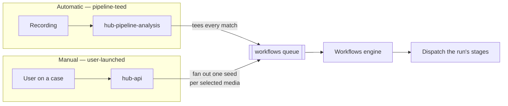
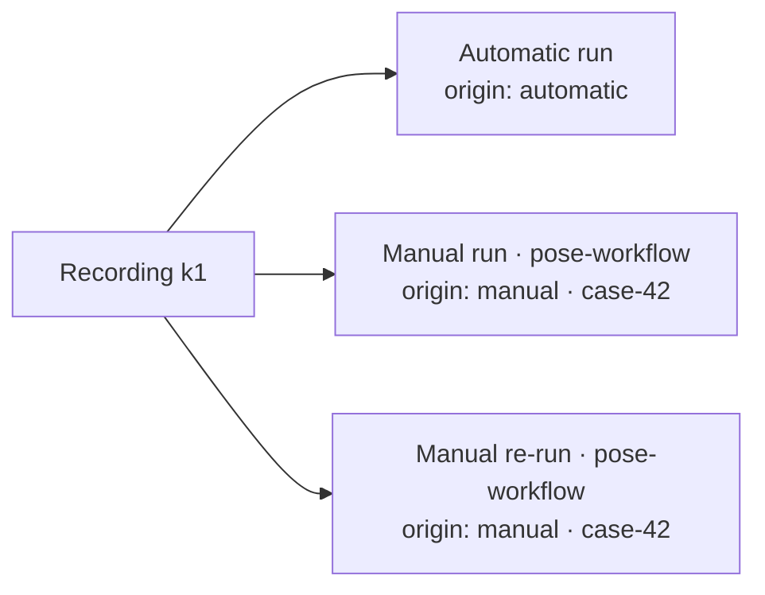
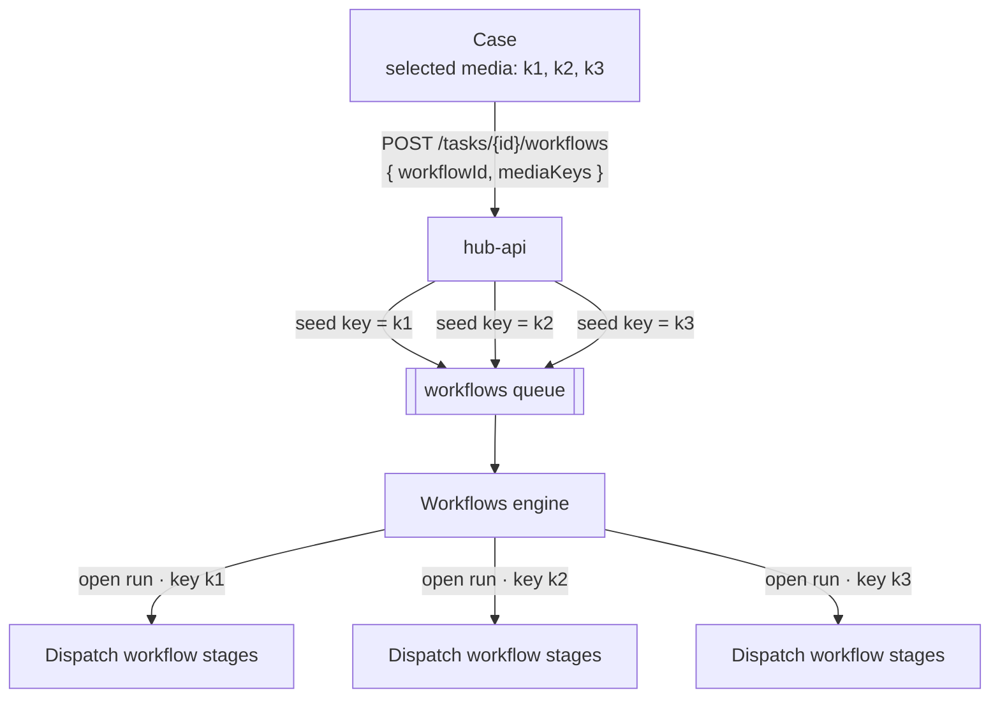
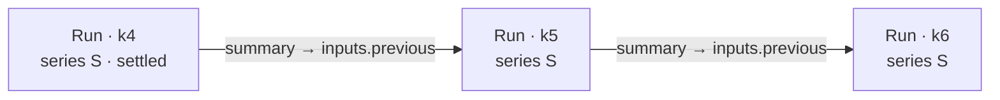


Both activation modes described here are live: automatic triggers fan out over
finished recordings, and manual triggers launch on demand from a case or media
surface. They resolve **both** deployment-wide config workflows and an
organisation's own stored workflows — see
[Deploying and operating](../#deploying-and-operating) for how the engine discovers
and dispatches each tier.


## Two ways a workflow activates

Every [workflow](../) is a graph of stages, but *what makes it run* is its
**trigger**. There are two fundamentally different activation modes:

| Mode | Who starts it | Scope | Example |
|------|---------------|-------|---------|
| **Automatic** | The pipeline itself — analysis tees each classified recording to the engine. | Every recording that matches the trigger's device selection and time window. | Run loitering detection on the warehouse camera, Mon–Fri 18:00–06:00. |
| **Manual** | A user, from a surface in the Hub UI (a case, a media page, …). | Exactly the media the user selected, on demand. | On a case, press *Run* to send all selected recordings through a pose-detection workflow. |

Automatic is what Workflows ship with today. Manual triggering is the new mode
this page describes — the same engine and stages, but a run is opened because a
**user asked for it on specific media**. Both modes converge on the same queue,
engine and stages; only the *origin* of the run differs.



## The trigger model

A trigger's *mode* is a property of the trigger, so one workflow can be **both**
automatically scheduled and manually runnable. A workflow therefore carries a
**list** of triggers — each tagged with a type, and for manual ones the surfaces
that expose it.

```go
type WorkflowTrigger struct {
    Type WorkflowTriggerType // "automatic" | "manual"

    // automatic: when the trigger is live — the same weekly-schedule shape the
    // alert/videowall schedules use (each entry carries its own day, time
    // segments and IANA timezone; weekday 0 = Sunday).
    WeeklySchedule []*WeeklySchedule

    // automatic: device/envelope scoping expressed with the same (path, op,
    // value) predicates a stage uses — a device-key set (`device.deviceKey in
    // […]`), a device-name regex, a site gate, … all ANDed together. The
    // editor's device picker is just a friendly way to author the
    // `device.deviceKey in […]` condition.
    Conditions []StageCondition

    // manual: which surfaces show the "Run" control ("case", "media", …)
    Surfaces []WorkflowTriggerSurface
}

type Workflow struct {
    // …
    Triggers []WorkflowTrigger // a workflow can be both automatic and manual

    // Deprecated: the legacy single, automatic-only trigger. Kept so
    // workflows saved before Triggers existed still decode; NormalizeTriggers
    // folds it into Triggers so callers only reason about the list.
    Trigger *WorkflowTrigger
}
```

The model now carries a **list** of triggers, each tagged with a `Type` and —
for manual ones — the `Surfaces` that expose it, so both modes coexist on one
workflow. The original single `Trigger` is retained as a deprecated field for
backwards compatibility and folded into `Triggers` by `NormalizeTriggers`, so
new code only ever reads and writes the list. Automatic scoping reuses the same
`WeeklySchedule` shape as the alert/videowall schedules — so the same
weekly-schedule editor and weekday/timezone conventions apply — and the editor's
device picker simply authors a `device.deviceKey in […]` condition.

### Scoping devices with conditions

Device selection is expressed with **[conditions](../stages/)** — the exact same
`(path, op, value)` predicates a stage's `needs` use, evaluated by one shared
operator engine, so trigger and stage matching stay consistent. Pin a fixed set
of cameras with `device.deviceKey` `in` `[keys…]`; the editor's device picker
writes exactly this condition for you.

A pre-existing **`devices:`** shorthand (a bare list of device keys) is still
accepted for backwards compatibility — it compiles to exactly that
`device.deviceKey in […]` condition and ANDs with any `conditions:` — but new
definitions should prefer `conditions:` for the full vocabulary below.

Because it's the full condition vocabulary (`eq`, `in`, `matches`, `contains`,
…), you're not limited to a static key list — match every camera whose **name**
follows a pattern with `matches` (a partial, unanchored RE2 regular expression),
or gate on any other envelope field:

```yaml
triggers:
  - type: automatic
    conditions:
      # A fixed set of cameras.
      - path: device.deviceKey
        op: in
        value: [cam-1, cam-2]
      # …and only the "lobby-*" ones among them, whatever their key.
      - path: device.deviceName
        op: matches
        value: "^lobby-"
```

The conditions match against the recording's **pre-run envelope** — the
credential-free `device.*` and `user.*` scalars known the moment a recording
arrives (the same roots a stage condition reads, minus the `inputs`/`results` a
run only accrues once it opens). Besides `device.deviceKey` / `device.deviceName`
/ `device.provider` / `device.storageSolution` and `user.organisationId`, the
envelope exposes **`device.siteIds`** — the list of sites the recording's device
is linked to — so you can scope a workflow to a whole site with
`device.siteIds contains site-42` (it's an array, so match it with `contains` /
`in` / `exists` / `matches`). Every condition must hold (**AND**), so you can
require both a specific key set *and* a name pattern. A trigger with no
conditions stays eligible for every recording. A trigger condition with an
invalid regex or an unknown/credential-bearing path is **rejected when the
definitions load**, so a mis-authored trigger fails fast rather than silently
matching nothing — the same fail-fast guarantee stage conditions get.

### Authoring triggers in configuration (Helm)

A **`source: config`** workflow declares its triggers as chart values under
`kerberoshub.workflows.definitions.<name>.triggers` — the same list the model
carries, passed through verbatim into the engine's `WORKFLOW_DEFINITIONS`. Omit
the block entirely for one bare automatic trigger (opens for every recording);
otherwise each list entry is one trigger with the fields for its `type`:

```yaml
kerberoshub:
  workflows:
    enabled: true                        # the engine master switch
    definitions:
      lobby-anpr:                        # map key = workflow name
        enabled: true
        triggers:
          - type: automatic              # automatic | manual
            conditions:                  # (path, op, value) predicates, all ANDed (omit = every recording)
              - { path: device.deviceKey,  op: in,       value: [cam-1] }    # a fixed set of cameras
              - { path: device.siteIds,    op: contains, value: site-42 }    # array gate: linked sites
              - { path: device.deviceName, op: matches,  value: "^lobby-" }  # RE2 name pattern
            weeklySchedule:              # recurring windows (omit = any time)
              - day: 1                   # 0=Sun … 6=Sat
                enabled: true
                timezone: "Europe/Brussels"
                segments:
                  - { start: 32400, end: 61200 }   # seconds since midnight (09:00–17:00)
          - type: manual                 # user-launched from a surface
            surfaces: [case, media]      # where the Run control appears: case | media
        stages:
          - operation: anpr              # its worker lives under services.anpr
            dispatch: always
```

The `name`/`source` fields and each stage's `queue` are filled in by the chart —
you never set them. Every stage `operation` still needs a deployed worker under
`kerberoshub.services.<operation>`; see [Stages](../stages/#registering-a-stage).
For the full workflow-definition shape (stages, `needs`, `needsMode`) see
[Defining a workflow in configuration](../#defining-a-workflow-in-configuration).

**Definition vs. run.** The trigger type lives on the `Workflow` — authoring
metadata ("this can be run manually from a case"). How a *specific* run was opened
lives on the `WorkflowRun` as its **origin** (`automatic` / `manual`) plus a
`sourceRef` such as the case id. The engine uses the origin to skip automatic
gating for on-demand runs and to attribute them to their source.

## Named workflows and run identity

Manual (and repeated) runs rest on two capabilities, and both now exist on
`WorkflowRun` in the model:

- **Run a specific workflow.** A run carries the **`workflowId`** of the
  workflow whose stages it executes, rather than every globally-registered
  stage. The engine reads the authored workflow definitions and fans one
  recording out into a run per matching workflow, stamping each run's
  `workflowId` so it dispatches only that workflow's stages.
- **Give each run its own identity.** Each run carries a **`runId`** — the hex
  of its run-document id, projected onto the wire automatically (a producer only
  ever stamps the id) and echoed back by every stage — so the engine ties a
  stage's result to the right run. The media key stays on the run, but it is no
  longer the identity, so one recording can carry several runs at once.

With a per-run `runId`, one recording can carry several independent runs at once
— its automatic analysis run and any manually-triggered workflows, re-runs
included:



The media key stays on every run, so *"all runs for a recording"* is still a
simple lookup by key — it now returns the whole list, filterable by workflow,
origin or source case.

### What a run message carries

Whatever opened it, a run travels the whole workflow tail as **one**
`WorkflowRun` message (JSON on the queue, the same shape persisted as the run
document). These are the fields a reader can expect to see on the wire:

| Field | Meaning |
|-------|---------|
| `operation` | The message's role: `"event"` for the analysis hand-off that opens a run, or the stage id for a dispatch/result hop. |
| `runId` | The run's wire identity — the hex of its document id. Empty on the analysis hand-off (keyed by `key` until the engine opens it), set on every hop after. |
| `workflowId` / `workflowName` | Which workflow the run executes. Empty on the analysis hand-off (one recording tees a single `event`); the engine assigns them as it fans that event out into a run per matching workflow definition. |
| `origin` | How the run was opened: `automatic` (pipeline-teed) or `manual` (user-launched). |
| `sourceRef` | What a manual run was launched from — e.g. the case id — so siblings from one action group together. Empty for automatic runs. |
| `key` | The media key the run is about — its natural identity, copied from the recording at hand-off. |
| `traceId` | Continues the distributed trace across the tail. |
| `user` / `device` | Curated, secret-free account and recording context (org, storage block, device key/name). |
| `inputs` | The immutable start context, keyed by upstream operation (e.g. `classify` → the classification result). Set once at open. |
| `results` | Accumulated stage outputs, keyed by operation — each worker writes its result here on the way back. |
| `payload` | A delegated-ingest worker's block envelope (detection + marker blocks) for the platform to persist. Worker → engine only. |
| `storage` / `signedUrl` | Credentials / a signed URL to fetch the media, set only on the engine → worker dispatch hop. Never persisted. |

Credential-bearing fields (`storage`, `signedUrl`) and the curated projections
are wire-only and never land in run state; the run's stored progress (start/end,
dispatched/resolved operations) never appears on the queue.

## Manual trigger on a case

The first manual surface is the **case**. A user selects recordings on a
[case](../cases/), picks a workflow and presses *Run*. A run's natural unit is
one recording, so the trigger **fans out one `WorkflowRun` per selected media
key** — the same hand-off analysis makes automatically, just originated by the
user.



Each seed carries the workflow to run, `origin: "manual"` and the case id
alongside the usual media key, signed URL and device context — reusing the
existing case-media enqueue pattern. Every run reports progress independently,
and its results — detection and marker [blocks](ingest/blocks/) — are mirrored
back onto the recording just like an automatic run's, so they appear on the
timeline and in the case.

The case "Run workflow" control is simply the list of workflows whose triggers
are manual and include the `case` surface, so adding one is a data change, not
code.

## Aggregating across recordings


Forward-looking. This is a sketch of how workflows will reason across recordings;
the aggregation layer below is **not built yet**.


A run's unit is one recording, but some questions span several — *is someone
loitering across the last few clips from this camera?* The recordings that belong
together are the ones from the **same device**, in time order, so a run already
carries what's needed to find its neighbours: `Device.DeviceKey` and
`RecordingTimestamp`.

Rather than chain each run to the literal "previous" one (fragile with
out-of-order or delayed clips), consecutive recordings within a window share a
**`deviceSeriesId`** — `(deviceKey, org, time-bucket)`. This is the automatic,
temporal twin of the `sourceRef` that groups a manual case batch: a case groups
runs a user picked, a series groups runs from a camera over time.

State moves forward through the run's **`Inputs`**. When the engine opens a run
in a series, it folds a bounded, one-hop summary of the predecessor under a
dedicated key so a stage can compare "this clip" against "last clip" without
losing provenance:

```yaml
inputs:
  classify:            # this recording's own result
    detections: [...]
  previous:            # carried from the prior run in the series
    recordingKey: k4
    dwellByZone: { entrance: 42s }
```



Two rules keep this safe:

- **One hop, bounded.** Carry the predecessor's *summary* (dwell accumulators,
  presence intervals, re-id vectors), not raw detections and not the whole
  history — otherwise each run snowballs the entire series.
- **Populated by the engine, gated by the window.** `Inputs` is otherwise minted
  by the sender, but the predecessor lookup belongs to the engine, which owns the
  run collection. It only folds in a predecessor that is **settled** and inside
  the series window; a gap starts a fresh series.

True aggregation *stages* — one run whose input is many sibling runs — remain
deferred; this carry-forward is the lighter first step that covers running
detections like loitering.

## Where definitions live

Workflows have two layers:

| Layer | What it is | Owned by |
|-------|-----------|----------|
| **Stage catalog** | The available stages (`WorkflowStage`: image, queue, resources) — each maps to a deployed worker. | Ops (Helm) |
| **Workflow definitions** | Which stages run, wired and triggered how (`Workflow`). | Users (frontend), plus optional built-ins seeded at deploy |

A workflow is a graph over the deployed stage catalog — users compose existing
stages, they don't add new worker images. A built-in such as a `cases-workflow`
that runs pose detection is just a `Workflow` document seeded at deploy time, so
ops-provided and user-authored workflows run through the same path.

## Glossary

| Term | Meaning |
|------|---------|
| **Trigger** | What activates a workflow — `automatic` (pipeline-teed) or `manual` (user-launched from a surface). |
| **Surface** | Where a manual trigger appears in the UI (`case`, `media`, …). |
| **Origin** | How a specific run was opened (`automatic` / `manual`), with a `sourceRef` such as a case id. |
| **runId** | A run's identity, echoed by every stage so results find their run; lets one recording have many runs. |
| **Series (deviceSeriesId)** | Consecutive recordings from one device within a time window, grouped so a run can carry state forward from the previous one. |
