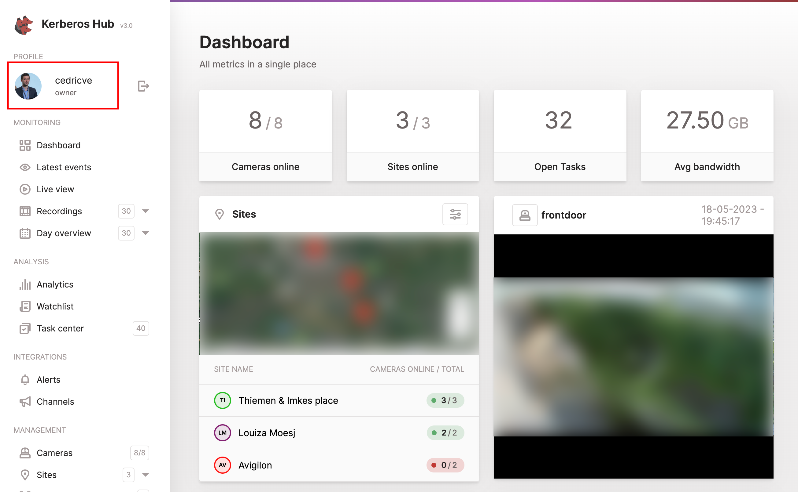
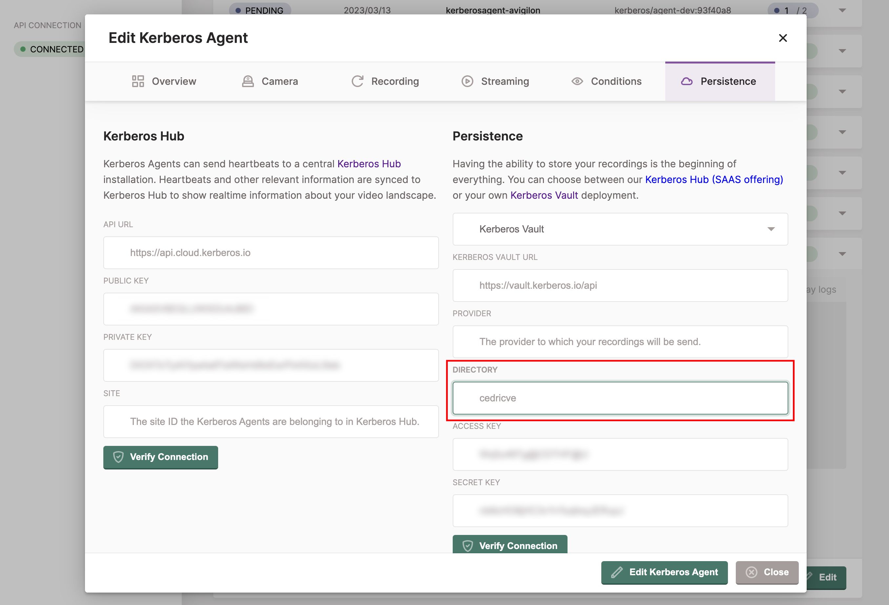
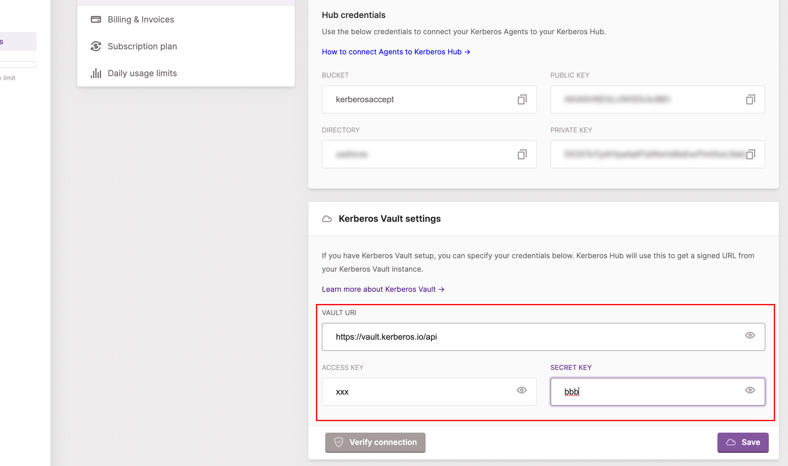

Integrations publish an event after Vault has stored a recording and its media
record. Use these events to feed another Vault, Kerberos Hub, or your own
message-driven application.

Vault currently supports:

- [Amazon SQS](https://aws.amazon.com/sqs/)
- [Apache Kafka](https://kafka.apache.org/)
- [RabbitMQ](https://www.rabbitmq.com/)
- [Kerberos Hub](/docs/hub/first-things-first/)
- Kerberos Vault forwarding

## Prerequisites

Install Vault and configure at least one [storage provider](/docs/vault/providers/).
An integration is not active for uploads until it is enabled and assigned to an
[account](/docs/vault/accounts/).

## Configuration of an integration

Open **Integrations** in the left navigation and select **Add Integration**.
Choose a type, provide an integration name and connection settings, then use
**Validate** before saving. Keep the **Enabled** toggle on when Vault should
deliver events.





You can create multiple integrations and assign any combination to an account.

## Queue integrations

### Amazon SQS

Provide the AWS region, queue name in **Topic**, access key, and secret access
key. The IAM identity must be able to send messages to that queue.

### Kafka

Provide the broker address, group, topic, username, password, SASL mechanism,
and security protocol expected by the broker. For example, a SASL-enabled
broker may use `PLAIN` with `SASL_PLAINTEXT`; use the values required by your
Kafka deployment.



Vault is a publisher. Consumers and topic lifecycle remain your responsibility.

### RabbitMQ

Provide the AMQP broker URL, queue, username, and password. **Exchange** is
optional; leave it empty to use the default exchange. Vault waits for publisher
confirmation before considering a delivery complete.

## Kerberos integrations

Vault can also publish directly to Kerberos services.

### Kerberos Vault

Choose **Continuous** to copy every uploaded recording, or **On demand** to
retain recordings locally until Kerberos Hub requests selected media. Configure
the destination Vault URL, provider, and an account access key and secret from
that destination.



See [Vault forwarding](/docs/vault/forwarding/) for the runtime settings and
on-demand request flow.

### Kerberos Hub

The Kerberos Hub integration sends each recording event to the
[Kerberos Hub pipeline](/docs/hub/pipeline/) for indexing, visualization, and
configured downstream processing. Provide the Hub API URL and credentials shown
by the integration form.



- **Integration name**: a unique descriptive name.
- **Kerberos Hub URL**: the Hub API base URL, for example
    `https://api.example.com`.
- **Hub key and credentials**: values assigned to the Hub account.

#### Kerberos Hub username

When creating a Kerberos Hub account and linking it to your own Kerberos Vault, you have to make sure the Kerberos Hub username is matching the Agent destination directory. If this not matching, your recordings will not be shown in the Kerberos Hub interface.

Once you logged in, or created an account, you will see your Kerberos Hub username at the left top of the navigation. You have to make sure this username, equals the directory field of the Agent (or Factory settings).

Make sure the `directory` field of your Agents or Factory is configured with the Kerberos Hub username.

#### Kerberos Vault credentials

Once you have added the integration to Kerberos Vault, and made sure the Kerberos Hub account name matches the Agent directory field, you should see some recordings landing into your Kerberos Hub account. However to view your recordings in Kerberos Hub, you'll need to add your Kerberos Vault credentials to your Kerberos Hub account (or installation).

As you are the owner of the Kerberos Vault, you'll need to make Kerberos Hub (SAAS or self-hosted) aware of where your Kerberos Vault is located (DNS name) and the Kerberos Vault account you have used.

As soon as you have configured the Kerberos Vault settings in your Kerberos Hub account, you should be able to open the recordings and view them in the application. If you change the Vault account credentials or disconnect Vault, Hub can no longer request those recordings.

## Durable delivery and retries

Vault writes one delivery entry per integration destination into the media row
before acknowledging the upload. A background worker retries pending RabbitMQ,
Kafka, SQS, and Hub deliveries with exponential backoff. Successful destinations
are removed independently, so one unavailable integration does not replay those
that already succeeded.

Delivery is **at least once**. A process can stop after a broker accepts a
message but before Vault records the success, so consumers must handle duplicate
events idempotently.

Use [Outbox](/docs/vault/outbox/) to inspect pending and retrying deliveries,
failure history, and per-destination payloads. The activity action beside an
integration opens its 60-minute delivery and latency view.
