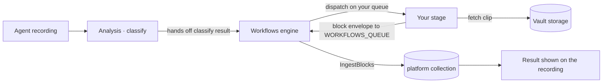





The Hub ships with a built-in pipeline, but every deployment eventually needs something the pipeline doesn't do out of the box. A custom **workflow stage** lets you run your own logic on every recording — its result feeds the rest of the workflow for later stages to build on, and the **blocks** it emits are persisted back into the Hub — in any language, deployed and scaled on its own.




A small **loitering** service that plugs into the Hub as a custom workflow stage and adds a **dwell-time marker** to the timeline of every matching recording. The loitering specifics are only an illustration — the **flow** carries over to any stage of your own. By the end you'll have:

- A custom stage **running in your cluster**
- The stage **registered through `values.yaml`** — no engine code changes
- The workflows engine **dispatching matching recordings** to your stage automatically
- Your result **kept on the workflow run** so later stages can build on it
- Your marker block **persisted to the Hub** and shown on the recording's timeline

This is the same microservice published at [`github.com/uug-ai/hub-loitering`](https://github.com/uug-ai/hub-loitering) — clone it to follow along, or build it up yourself below.


## What can a stage do?

If you can express it as *"take a recording, do some work, return a result,"* it fits a stage. A few things teams build:

<div class="tutorial-grid">

  
  
  
  
  

</div>

## How it works

A **stage** is a step in a workflow; you implement it as a **microservice**. This tutorial walks you through bringing a microservice of your own into the Hub as a [stage](/docs/hub/workflows/stages/) that the workflow triggers automatically. You'll wire it end-to-end: deploy a microservice, bind the microservice to a stage in a workflow using the Helm chart, do whatever work your stage does on each recording, and hand the result back — where the workflow carries the results of your stage to later stages and the **blocks** you emit are **persisted into the Hub**.

The example microservice is written in Go, but a stage is **language-agnostic** — the only contract is the queue it reads and the JSON it returns, so the same steps apply in Python, Node.js or anything that can speak your broker.

## Before you start


This tutorial targets a **self-hosted Hub** that can run custom stages. Make sure you have:

- A **self-hosted Hub** deployed with the [Helm chart](/docs/hub/installation/), including a RabbitMQ broker and MongoDB database
- `helm` and `kubectl` access to the cluster running Hub
- A **container registry** you can push an image to (e.g. `ghcr.io/acme`)
- The **workflows engine** in your chart (`kerberoshub.workflows`)



**On a managed / cloud Hub?** You can't deploy a custom stage there, but you can deliver the *same* result over HTTP instead — the [ingest API](/docs/hub/workflows/ingest/#over-the-api-post-ingest) accepts the same `marker` block (the run shape is the [marker contract](/docs/hub/workflows/ingest/blocks/marker/)). The rest of this tutorial is for deployments you control.


This tutorial puts two reference pages into practice, and it helps to have skimmed them first — [Workflows → Stages](/docs/hub/workflows/stages/) (how a microservice connects) and [Workflows → Ingest](/docs/hub/workflows/ingest/) (what it hands back). This tutorial is the hands-on path through both.

## Pipeline vs workflows

Before you build a stage, it's worth knowing where it lives. The Hub has two layers that connect at a single point.

The **[pipeline](/docs/hub/pipeline/)** is the fixed flow every recording runs through by default — monitor, sequence, analysis, throttle, notify. It's the same for everyone, it always runs, and it's the baseline that turns a raw recording into a classified, alertable event.

A **[workflow](/docs/hub/workflows/)** is a **branch off that flow**. At the analysis step the pipeline hands the classified recording to the workflows engine, which forks a custom flow of your own — your stages — runs it, and feeds the result back. The main pipeline keeps doing its job; the workflow is the side-path where *your* processing happens, decided per user, per device and per time window.


{
  "groups": [
    { "id": "hub",   "label": "Pipeline",    "x":   0, "y":   0, "w": 980, "h": 220 },
    { "id": "yours", "label": "Workflow",  "x":   0, "y": 300, "w": 980, "h": 280 }
  ],
  "nodes": [
    { "id": "analysis", "kind": "pipeline-analysis",     "x":  40, "y":  60, "w": 220, "h": 100,
      "header": "PIPELINE", "title": "Analysis", "subtitle": "kcloud-classify-queue.fifo", "groupId": "hub" },
    { "id": "throttle", "kind": "pipeline-threshold",    "x": 380, "y":  60, "w": 220, "h": 100,
      "header": "PIPELINE", "title": "Throttle", "subtitle": "kcloud-throttler-queue", "groupId": "hub" },
    { "id": "notify",   "kind": "pipeline-notification", "x": 720, "y":  60, "w": 220, "h": 100,
      "header": "PIPELINE", "title": "Notify", "subtitle": "kcloud-notification-queue", "groupId": "hub" },
    { "id": "engine",   "kind": "hub",                   "x":  40, "y": 390, "w": 220, "h": 100,
      "header": "ENGINE", "title": "Workflows", "subtitle": "hub-workflows-queue", "groupId": "yours" },
    { "id": "stage",    "x": 420, "y": 390, "w": 210, "h": 100,
      "header": "STAGE", "title": "Your stage #1", "subtitle": "hub-workflows-stage1", "groupId": "yours" },
    { "id": "stage2",   "x": 700, "y": 390, "w": 210, "h": 100,
      "header": "STAGE", "title": "Your stage #2", "subtitle": "hub-workflows-stage2", "groupId": "yours" }
  ],
  "connections": [
    { "from": "analysis", "to": "throttle", "fromSide": "right",  "toSide": "left", "kind": "solid" },
    { "from": "throttle", "to": "notify",   "fromSide": "right",  "toSide": "left", "kind": "solid" },
    { "from": "analysis", "to": "engine",   "fromSide": "bottom", "toSide": "top",  "kind": "solid",  "label": "" },
    { "from": "engine",   "to": "stage",    "fromSide": "right",  "toSide": "left", "kind": "solid",  "label": "dispatch" },
    { "from": "engine",   "to": "stage2",   "fromSide": "top",    "toSide": "top",  "kind": "solid",  "label": "dispatch" },
    { "from": "stage",    "to": "engine",   "fromSide": "bottom", "toSide": "bottom", "kind": "dashed", "label": "result back", "offset": 20, "animated": true },
    { "from": "stage2",   "to": "engine",   "fromSide": "bottom", "toSide": "bottom", "kind": "dashed", "label": "result back", "offset": 60 }
  ]
}


| | Pipeline | Workflow |
|---|---|---|
| **Shape** | The fixed flow every recording runs through | A branch that forks off the main flow to run a custom flow |
| **Scope** | Global — the same for every recording | Per user, per device, per time window |
| **Changed by** | The platform | You, with no code (visual editor) — or with a custom stage |
| **Your stage lives here** | — | ✓ |

A **custom stage** — what you're about to build — is the developer side of that branch: your own microservice, in any language, that the workflow dispatches recordings to and whose result the platform ingests back. The pipeline classifies the recording; the workflow branches off to your stage; your stage does the work and hands a result back.


**The direction of travel.** Workflows are expected to gradually supersede the static pipeline as the primary way recordings are routed and enriched. Building on the workflows layer — as this tutorial does — is building on where the Hub is heading.


## The end-to-end flow

A recording is classified by the built-in pipeline. On classification, the analysis service hands the classification result to the **workflows engine** (`hub-workflows`), which opens a `WorkflowRun` and dispatches every registered stage onto its own queue. Your microservice consumes the run, does its work, and routes the result back through the concept of **Blocks**. The engine records that result on the run — so later stages can branch on it — and runs the shared **ingest core**, which persists any **blocks** you emit into a platform-owned collection.



Two names do all the routing, and it's worth keeping them straight:

- **The stage / operation id** — *who* the engine dispatches to and the key your result is filed under (`results.<id>`). In our example it's `loitering`.
- **The block type** — *what shape* your result is. A stage emits whichever block type fits its output: a `detection` block for boxes/tracks, a `marker` block for a timeline annotation. Our loitering stage emits a `marker` block.

The platform already knows how to store these block types — a `marker` block becomes a timeline annotation keyed to the recording — so **your microservice needs no database of its own**: it hands the data back and the platform persists it. That's the *delegated* sink; see [Ingest](/docs/hub/workflows/ingest/) for the full contract.

A **block** is one self-describing piece of that result: a `type` naming its shape (`detection`, `marker`, …) and a `data` body in that shape. Your microservice returns them as a **block envelope** — a small JSON object with a `blocks` array — set on the run's `payload`:

```json
{
  "blocks": [
    { "type": "marker", "data": { "...": "your result, in that block's shape" } }
  ]
}
```

A single envelope can carry several blocks (a detection plus a marker, say), and the platform stores each by its `type`. The [Blocks](/docs/hub/workflows/ingest/blocks/) catalogue lists every block type and the `data` shape it expects.

## Build the stage

Eight steps, from an empty folder to a dwell-time marker on a recording. Steps 1–5 build the microservice; 6–8 register, deploy and verify it.

{}

### Decide your stage's identity

A stage is defined by four choices. Pick them now; everything else follows (the values here are our loitering example):

| Choice | Example | Why it matters |
|---|---|---|
| **Operation id** | `loitering` | Routing key, result key (`results.loitering`), and the name you register. |
| **Queue** | `hub-workflows-loitering` | The one string that binds the engine to your microservice. Any name your broker accepts. |
| **Block type** | `marker` | The result shape you emit. `marker` → a timeline span in the `markers` collection. |
| **Sink** | delegated | Hand a block envelope back; the platform persists it. No database in your microservice. |

### Scaffold the microservice

Create a new Go module for the microservice:

```bash
mkdir hub-loitering && cd hub-loitering
go mod init github.com/uug-ai/hub-loitering
go get github.com/uug-ai/models@v1.6.3
go get github.com/uug-ai/queue@v1.3.6
go get github.com/sirupsen/logrus@v1.9.4
```


**Prefer the finished microservice?** Everything Steps 2–5 build is published as a clone-and-build module — `git clone https://github.com/uug-ai/hub-loitering && cd hub-loitering && go build ./...` — so you can clone it and jump straight to registering the stage.


The microservice reads its configuration from the **connection contract** — a fixed set of environment variables the chart injects into every microservice. You don't invent these names; the chart provides them:

| Variable | Example | What it is |
|---|---|---|
| `QUEUE_SYSTEM` | `RABBITMQ` | The broker driver. |
| `RABBITMQ_HOST` / `RABBITMQ_EXCHANGE` / `RABBITMQ_USERNAME` / `RABBITMQ_PASSWORD` | `rabbitmq.rabbitmq:5672` | Broker connection. |
| `LOITERING_QUEUE` | `hub-workflows-loitering` | The queue you **consume** runs from (your stage id, upper-cased, `+ _QUEUE`). |
| `WORKFLOWS_QUEUE` | `hub-workflows-queue` | The engine queue you **return** the finished run to. |
| `KERBEROS_STORAGE_URI` / `KERBEROS_STORAGE_ACCESS_KEY` / `KERBEROS_STORAGE_SECRET` | `https://vault…` | Fallback media-storage endpoint (per-recording overrides also travel on each run). |
| `LOG_LEVEL` | `info` | Log verbosity. |

Here is `main.go` — connect to the broker, consume raw `WorkflowRun` messages, and hand each one to a handler:

```go
package main

import (
	"encoding/json"
	"os"
	"strings"
	"time"

	"github.com/sirupsen/logrus"

	"github.com/uug-ai/models/pkg/models"
	queue "github.com/uug-ai/queue/pkg/queue"
)

// operation is this stage's id. It must match the operation registered in the
// Helm chart, and it is the key the engine files your result under.
const operation = "loitering"

func main() {
	logger := logrus.New()
	logger.SetFormatter(&logrus.JSONFormatter{})

	// The stage queue we consume from, and the engine queue we return to.
	stageQueue := envOr("LOITERING_QUEUE", "hub-workflows-loitering")
	workflowsQueue := envOr("WORKFLOWS_QUEUE", "hub-workflows-queue")

	// A stage only consumes and dead-letters; it never forwards down a stage
	// list, so it sets just its consume queue and a deadletter queue.
	options := queue.NewRabbitOptions().
		SetHost(os.Getenv("RABBITMQ_HOST")).
		SetExchange(os.Getenv("RABBITMQ_EXCHANGE")).
		SetUsername(os.Getenv("RABBITMQ_USERNAME")).
		SetPassword(os.Getenv("RABBITMQ_PASSWORD")).
		SetWorkflowsStageQueue(stageQueue).
		SetDeadletterQueue("dead-letter-queue").
		Build()

	q, err := queue.New(options)
	if err != nil {
		logger.Fatalf("failed to create queue: %v", err)
	}
	if err := q.Client.Connect(); err != nil {
		logger.Fatalf("failed to connect to broker: %v", err)
	}
	logger.Infof("loitering started: consuming %q, returning results to %q", stageQueue, workflowsQueue)

	// The workflow subsystem exchanges models.WorkflowRun (not the pipeline's
	// PipelineEvent), so decode the run ourselves. A body that isn't a
	// WorkflowRun is dead-lettered; otherwise the handler routes it back.
	handler := func(payload []byte, _ ...any) (models.PipelineAction, []byte, int) {
		var run models.WorkflowRun
		if err := json.Unmarshal(payload, &run); err != nil {
			logger.Errorf("not a WorkflowRun, dead-lettering: %v", err)
			return models.PipelineError, payload, 0
		}
		return handleRun(logger, q.Client, workflowsQueue, &run), payload, 0
	}

	rmq, ok := q.Client.(*queue.RabbitMQ)
	if !ok {
		logger.Fatalf("loitering requires a *queue.RabbitMQ client, got %T", q.Client)
	}
	for {
		if err := rmq.ReadRawMessages(handler, func(models.PipelineMetrics) {}); err != nil {
			logger.Errorf("failed to read messages: %v", err)
		}
		if err := rmq.Reconnect(); err != nil {
			logger.Errorf("failed to reconnect: %v", err)
			time.Sleep(5 * time.Second)
		}
	}
}

func envOr(name, fallback string) string {
	if v := strings.TrimSpace(os.Getenv(name)); v != "" {
		return v
	}
	return fallback
}
```


**Any language works.** The contract is just JSON: consume a `WorkflowRun` from your queue, and return one to `WORKFLOWS_QUEUE` with your result as a **block envelope** on `payload` (its shape is shown below). The [envelope reference](/docs/hub/workflows/stages/#envelope) lists every field you receive.


### Do the work

This is the one step that's truly yours: whatever your stage actually does. Your microservice is a stateless consumer — pull a run, read (or fetch) what it needs, compute, and return. The run tells you **which** recording it is (`key`), **how** to fetch the media if you need it (`storage`), and carries the upstream `classify` result you can build on.

In our example the work is loitering — *how long the longest-lingering subject stays in frame.* The classifier has already tracked every subject, so this stage needs no model and no media download: it measures the dwell span straight from the `classify` trajectory on the run and turns it into a **marker**. Whatever your stage does, this is where it slots in.

Create `loiter.go`:

```go
package main

import (
	"github.com/uug-ai/models/pkg/models"
)

// measureLoitering is where your stage's logic runs. Here it reads the dwell
// span the classifier already tracked and turns the longest one into a marker.
// A heavier stage would instead fetch the clip referenced by run.Key with the
// credentials in run.Storage and run its own model. This stub returns one fixed
// 30-second marker so you can prove the wiring before plugging in real analysis.
func measureLoitering(run *models.WorkflowRun) models.Marker {
	const start, duration = 1_700_000_000, 30 // recording epoch + dwell seconds
	return models.Marker{
		Name:           "loitering-person-1",
		Description:    "Subject lingered in frame",
		StartTimestamp: start,
		EndTimestamp:   start + duration,
		Categories:     []models.MarkerCategory{{Name: "alert"}, {Name: "person"}},
		Tags:           []models.MarkerTag{{Name: operation}},
		Events: []models.MarkerEvent{{
			Name:           "Loitering",
			StartTimestamp: start,
			EndTimestamp:   start + duration,
		}},
	}
}
```

A marker is a **named span on the recording's timeline** — a `Name` plus start/end timestamps — optionally carrying categories, tags and events. You leave `Duration` unset; the platform fills it from the timestamps. It keys the marker by `(device, name, startTimestamp)`, so a redelivery refreshes the same marker instead of duplicating it — see the [marker run contract](/docs/hub/workflows/ingest/blocks/marker/) for every field.

### Return the result as a block envelope

Now hand the result back. You return the **same `WorkflowRun` you received** — echo its identity so the engine can locate and scope it — with `storage` cleared and your result wrapped in a self-describing **block envelope** on `payload`. Publish it to `WORKFLOWS_QUEUE`; the engine routes each block through the ingest core into the right platform collection and marks the **stage** resolved. In our example that's a single `marker` block landing in the `markers` collection.

Concretely, the `payload` you publish is that envelope with one `marker` block whose `data` is the marker from Step 3:

```json
{
  "blocks": [
    {
      "type": "marker",
      "data": { "name": "loitering-person-1", "startTimestamp": 1700000000, "endTimestamp": 1700000030 }
    }
  ]
}
```

In Go you don't hand-write that JSON — the `ingest` package builds and tags the envelope for you. Add the handler to `loiter.go`:

```go
import (
	"encoding/json"

	"github.com/sirupsen/logrus"

	ingest "github.com/uug-ai/ingest/pkg/ingest"
	queue "github.com/uug-ai/queue/pkg/queue"
)

func handleRun(logger *logrus.Logger, q queue.QueueInterface, workflowsQueue string, run *models.WorkflowRun) models.PipelineAction {
	logger.WithFields(logrus.Fields{
		"operation": run.Operation,
		"runId":     run.RunId,
		"mediaKey":  run.Key,
		"deviceKey": run.Device.DeviceKey,
	}).Info("loitering received dispatch")

	// 1. Measure the dwell (Step 3).
	marker := measureLoitering(run)

	// 2. Wrap the marker in a block envelope. A loitering stage emits one marker
	//    block; a richer stage could append detections or other block types in
	//    the same list. The platform keys the marker by (device, name,
	//    startTimestamp), so a redelivery refreshes it instead of duplicating.
	data, err := json.Marshal(marker)
	if err != nil {
		logger.Errorf("failed to marshal marker: %v", err)
		return models.PipelineCancel
	}
	envelope, err := json.Marshal(ingest.BlockEnvelope{
		Blocks: []ingest.Block{{Type: ingest.KindMarker, Data: data}},
	})
	if err != nil {
		logger.Errorf("failed to marshal envelope: %v", err)
		return models.PipelineCancel
	}

	// 3. Return the SAME run: echo identity, clear storage, attach the envelope.
	result := *run
	result.Operation = operation
	result.Storage = nil // credentials are never echoed back
	result.Payload = envelope

	body, err := json.Marshal(&result)
	if err != nil {
		logger.Errorf("failed to marshal result: %v", err)
		return models.PipelineCancel
	}
	if err := q.Publish(workflowsQueue, body); err != nil {
		logger.Errorf("failed to return result to %q: %v", workflowsQueue, err)
	}

	// We've already routed the result back ourselves, so there's nothing for the
	// queue library to forward.
	return models.PipelineCancel
}
```

Build it to be sure everything resolves:

```bash
go mod tidy
go build ./...
```

That's the whole microservice: **consume a run → do the work → return a block envelope.** Everything else — storing the result, keying it to the recording, surfacing it in the UI — is the platform's job.

### Containerise the microservice

A minimal multi-stage build:

```dockerfile
# Dockerfile
FROM golang:1.25-bookworm AS builder
WORKDIR /src
COPY go.mod go.sum ./
RUN go mod download
COPY . .
RUN CGO_ENABLED=0 go build -tags timetzdata,netgo -ldflags '-s -w' -o /out/loitering .

FROM alpine:latest
RUN apk add --no-cache ca-certificates && adduser -S loitering
USER loitering
COPY --from=builder /out/loitering /usr/local/bin/loitering
ENTRYPOINT ["loitering"]
```

Build and push to your registry:

```bash
docker build -t ghcr.io/uug-ai/hub-loitering:v1.0.0 .
docker push ghcr.io/uug-ai/hub-loitering:v1.0.0
```

### Register the stage in the Helm chart

This is the only platform change, and it's pure configuration. A stage is **two halves that share one name** under `kerberoshub`, and both only take effect when the workflows engine is on. Add them to your Hub `values.yaml` (or an environment overlay):

```yaml
kerberoshub:
  workflows:
    enabled: true                  # master switch: the workflows engine

    # ── the workflow stage object: declare + route ──────────────
    stages:
      loitering:                   # stage id (and default operation id)
        enabled: true              # route to this stage
        dispatch: conditional      # only on matching recordings (see below)
        needsMode: any
        needs:
          - operation: classify    # wait until the classifier has run…
            condition:             # …and only if it saw a person
              path: inputs.classify.properties
              op: contains
              value: person

  # ── the deployments: your microservice ────────────────────────────
  services:
    loitering:                     # same name as the stage object
      enabled: true                # deploy the microservice pod
      repository: ghcr.io/uug-ai/hub-loitering
      tag: "v1.0.0"
      queue: "hub-workflows-loitering" # the queue your microservice consumes
      replicas: 1
      pullPolicy: IfNotPresent
      logLevel: info
```

A few things to get right here:

- **Both `enabled` flags, plus the engine.** Routing with no microservice queues messages nobody reads; a microservice with no routing never receives any. Turn on `workflows.enabled`, `workflows.stages.loitering.enabled` **and** `services.loitering.enabled`.
- **The queue must match.** The engine dispatches to `services.loitering.queue`, and your microservice consumes that exact value via `LOITERING_QUEUE`. They are the one binding between the two.
- **`dispatch: conditional` is optional.** Use `dispatch: always` to run on every recording. Here we gate on the classifier seeing a `person`, so the loitering stage never runs on empty scenes. The engine validates every condition `path` at boot and refuses to start on an unknown one. See [Conditional routing](/docs/hub/workflows/stages/#conditional-routing) for the full rule grammar.
- **It's the engine switch, not the UI one.** `kerberoshub.workflows.enabled` toggles the engine. Don't confuse it with the unrelated `…features.workflows` front-end feature flag.

### Deploy

Apply the values and roll it out:

```bash
helm upgrade hub kerberos/hub -n kerberos-hub -f values.yaml
```

Confirm both the engine and your microservice are running:

```bash
kubectl -n kerberos-hub get pods | grep -E 'workflows|loitering'
kubectl -n kerberos-hub logs deploy/hub-loitering
   # loitering started: consuming "hub-workflows-loitering", returning results to "hub-workflows-queue"
```

### Verify end-to-end

Trigger a recording that matches your rule (here: one where the classifier sees a **person**) — either wait for a live event from a connected Agent, or re-analyse an existing recording from the Hub UI.

1. **Watch the engine dispatch.** The workflows engine logs the run opening and dispatching the `loitering` stage to `hub-workflows-loitering`:

   ```bash
   kubectl -n kerberos-hub logs deploy/hub-workflows -f
   ```

2. **Watch your microservice.** It logs the dispatch it received and the result it returned:

   ```bash
   kubectl -n kerberos-hub logs deploy/hub-loitering -f
   # loitering received dispatch  runId=… mediaKey=front-gate/2026/06/12/08-30-00.mp4
   ```

3. **See the marker in the Hub.** Open that recording in the Hub — the loitering marker your microservice produced appears on the timeline. Under the hood it was stored as a `Marker` in the `markers` collection, keyed to the recording. You can confirm directly:

   ```js
   // mongosh
   db.markers.find({ name: "loitering-person-1" }).pretty()
   ```

That's the full loop: a recording was classified, the engine dispatched it to **your** service, your service did its work (here, measured a dwell span) and handed the result back, and the platform ingested it onto the recording — with no engine code changed.

{}


You shipped a custom capability into the Hub without touching engine code. The same four-beat shape — **consume → fetch → work → return** — is every stage you'll ever build; only Step 3 changes.


## Troubleshooting

{}
Check all three switches are on (`workflows.enabled`, `workflows.stages.loitering.enabled`, `services.loitering.enabled`) and that `services.loitering.queue` exactly equals the microservice's `LOITERING_QUEUE`. A conditional stage also never fires if its rule never matches — try `dispatch: always` to isolate routing from the condition.
{}

{}
A condition `path` is validated at boot; a typo (e.g. `inputs.classify.property`) fails fast. Check the `hub-workflows` pod logs for the rejected path.
{}

{}
Delivery is at-least-once, so make your result idempotent by its natural key. A marker is upserted by `(device, name, startTimestamp)` — keep those stable across redeliveries (a detection block does the same via `Source.RunId`).
{}

{}
Make sure you publish the run back to `WORKFLOWS_QUEUE` after the work is done, with the run's identity (`runId`, `key`, `traceId`, `user`) echoed and `storage` cleared.
{}

{}
A marker's `startTimestamp`/`endTimestamp` are **Unix seconds**, not frame numbers or offsets. Derive them from the recording's epoch so the span lines up with the timeline.
{}

## Next steps

<div class="tutorial-grid">

  
  
  

</div>

## See also

<div class="tutorial-grid">

  
  
  
  

</div>
